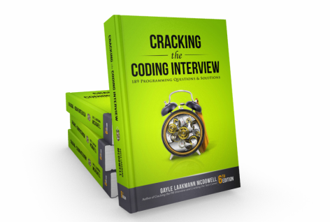
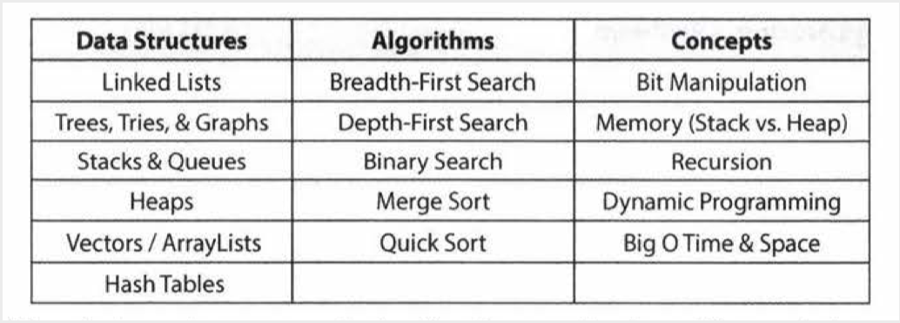
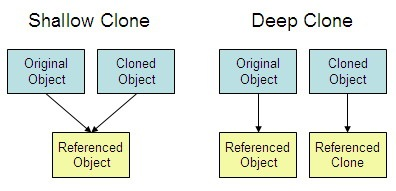

## Problems from Cracking the Coding Interview

This repository contains solutions to problems Gayle Laakmann's "Cracking the Coding Interview". It is divided into 4 folders corresponding to the chapters in the "Interview Questions" section of the book.

1. Data Structures (Chapters 1 to 5)
2. Concepts and Algorithms (Chapters 5 to 11)
3. Knowledge Based (Chapter 12 to 15)

I have been coding in C++ for practice, so I have been reading the book "Optimized C++" by Kurt Guntheroth. Optimization is a coding activity. In traditional software development processes, optimization takes place after Code Complete, during the integration and testing phase of a project, when the performance of a whole program can be observed. In an Agile development process, one or more sprints may be allocated to optimization after a feature with performance goals is coded, or as needed to meet performance targets. 

Initially, C++ was under assault as fans of Java/Python/C# claimed that C++ was too hard to use, and that their tools were the future. Universities settled on Python for teaching because it is easy to learn for begineers, and its slow speed is not an issue for academic projects. Even big companies like Oracle poured millions of dollars into promoting Java as the "King of Enterprise Applications." And C# was started by Microsoft for purely selfish reasons— they wanted to kill Java. C++ seemed to be on the wane. It was an uncomfortable time for anyone who believed C++ was a powerful, useful tool. Then a funny thing happened. Processor cores stopped getting faster, but workloads kept growing. Those same companies began hiring C++ programmers to solve their scaling issues. The cost of rewriting code from scratch in C++ became less than the cost of the electricity going into their data centers. All of a sudden, C++ was popular again. Uniquely among programming languages in wide use in early 2016, C++ offers developers a continuum of implementation choices, ranging from hands-off, automated support to fine manual control. C++ empowers developers to take control of performance trade-offs. This control makes optimization possible.

Most interviewers won't ask about specific algorithms for binary tree balancing or other complex algorithms. Frankly, being several years out of school, they probably don't remember these algorithms either. The more problems you do, the more developed your instinct on which data structure to apply will be. You will also develop a more finely tuned instinct as to which of these approaches is the most useful. 

Practicing implementing the data structures and algorithm (on paper, and then on a computer) is also a great exercise. It will help you learn how the internals of the data structures work, which is important for many interviews. Keep in mind the difference between a shallow copy and a deep copy, which will be needed to write the class definition for copy constructors and assignment operator.

GDB debugger tutorial (for segmentation faults):- http://www.unknownroad.com/rtfm/gdbtut/gdbtoc.html

GDB installation for MacOS:- https://www.ics.uci.edu/~pattis/common/handouts/macmingweclipse/allexperimental/mac-gdb-install.html

macOS uses Xcode Developer tools for compiling, which uses LLDB debugger which is very similar to GDB:- https://lldb.llvm.org/use/map.html
